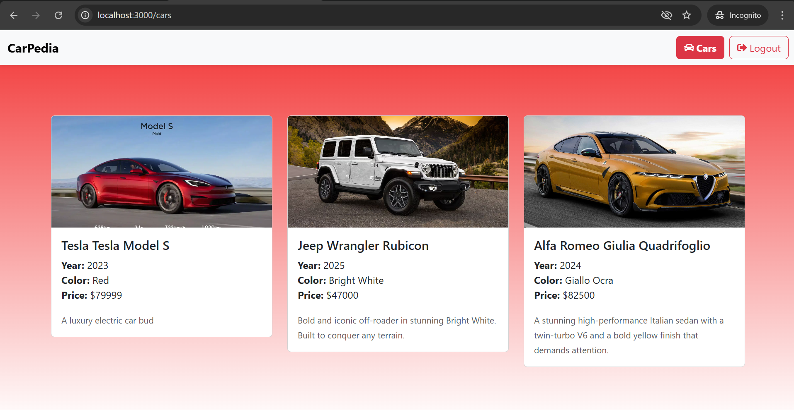

# 🚗 CarPedia

CarPedia is a full-stack car catalog web application where users can sign up, log in, add new cars, and view their personalized list of cars. It features a responsive Bootstrap UI, JWT-based authentication, and a Go/Gin backend with MongoDB.

---

## 📸 Screenshot



## 🛠️ Tech Stack

- **Frontend:** React, Bootstrap, Axios
- **Backend:** Go, Gin (REST API)
- **Database:** MongoDB
- **Authentication:** JWT
- **Icons:** React Icons, Bootstrap Icons

---

## ⚙️ Features

- 🔐 **User Authentication** (Sign up & Login)
- 🚙 **Add New Cars** with model, brand, year, color, price, description, image
- 📋 **My Cars Dashboard** to view all user-added cars
- 🔒 **Protected Routes** for authenticated users only
- 🔧 **Responsive Design** with Bootstrap

---

## 🚀 Getting Started

### Prerequisites

- **Node.js** & **npm**
- **Go** (1.18+)
- **MongoDB** (local or Atlas)

### 1. Clone the Repo

```bash
git clone https://github.com/yourusername/carpedia.git
cd carpedia

2. Frontend Setup
npm install
npm run start
# App runs at http://localhost:3000

3. Backend Setup

cd /backend
go mod tidy
go run main.go
# API server runs at http://localhost:5000


🔄 Architecture Overview

[ React Frontend ]
       ↕ Axios
[ Go + Gin Backend ]
       ↕ MongoDB

1. React Frontend

    Axios calls to /api/login, /api/signup, /api/cars/user

    Stores JWT and userId in localStorage

2. Go + Gin Backend

    Auth routes (/api/login, /api/signup)

    Car routes (/api/cars/user) with JWT validation

3. MongoDB

    users collection

    cars collection (each doc has userId reference)

✍️ Author
Vikas

GitHub: https://github.com/vikgi

Email: vikasgv02@gmail.com
```
